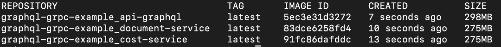

:grpc: https://grpc.io/
:netflix-graphql: https://netflix.github.io/dgs/
:icons: font
:source-highlighter: prettify
:project_id: graphql-grpc-example
:master-branch: https://github.com/singh-as/graphql-grpc-example.git
:project-name: graphql-grpc-example

This example uses {netflix-graphql}[Netflix DGS GraphQl] and for {grpc}[gRPC] for inter-service communication.

== Pre-requisite

- Java 8 or higher
- Docker
- Git
- Gradle

== Build & Run Application
* Checkout
** Clone the repo: git clone {master-branch}[{project-name}]
** cd {project-name}

//-

* Build artifacts - jars & images

[subs="attributes"]
----
# Build sub-projects all or specific
gradle build
gradle :[sub-project]:build

# Delete build directory all or specific
gradle clean
gradle :[sub-project]:clean

Examples-
gradle :common-utils:build
gradle :common-utils:clean

# Build images: will create three images- api-graphql, cost-service, document-service
docker-compose build

# Verify the images
docker images --filter "label=app=graphql-grpc"
----

** Run the Application
[subs="attributes"]
----
docker-compose up

# Stop the application
docker-compose stop
----

** Access application - http://localhost:8080/graphiql

[source,jsonpath]
----
Sample request payload, see below

{
    viewPlans(planCodes: ["004S2C"]) {
        code
        name
        benefitType
        carrier
        cost {
            emplCovrgRate
            emplrCovrgRate
        }
        document {
            description
            path
        }
        attributes {
            name
            value
        }
    }
}
----

** Miscellaneous
[subs="attributes"]
----
# Return containers in running state
docker ps --filter "label=app=graphql-grpc"

# Return containers in stop state
docker ps --filter "label=app=graphql-grpc" -a

# Delete containers
docker-compose rm

# Delete images
docker rmi $(docker images --filter "label=app=graphql-grpc" -q)
----
